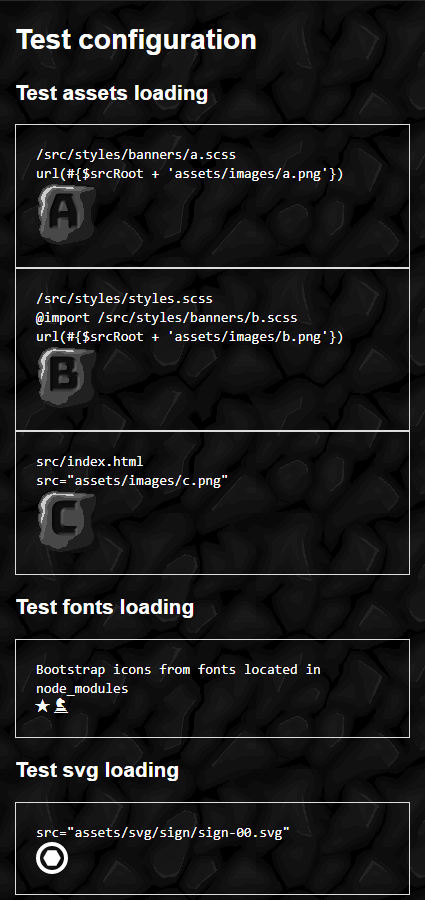

[](https://travis-ci.org/Xesenix/webpack-3-scaffold)
[](https://ci.appveyor.com/project/xesenix/webpack-scaffold)
[](https://coveralls.io/github/Xesenix/webpack-3-scaffold?branch=master)
[](https://snyk.io/test/github/xesenix/webpack-scaffold?targetFile=package.json)
[](https://david-dm.org/Xesenix/webpack-scaffold)


# Webpack 3 scaffold project

[](https://webpack-scaffold.herokuapp.com/)

## DEMO

Check live [demo](https://webpack-scaffold.herokuapp.com) of running this scaffold.

## About

This is basic starting point for application using __webpack v3__ with some default configuration setup to properly load assets from different locations.

### Workflow

It's work in progress but you can use those processes:

#### For development with HMR

* Run `npm run [appName]:build:dev` this will copy vendor assets to local folder where from they can be served (if some assets are missing during development run this)
* Run `npm run [appName]:serve:dev` this will start `webpack-dev-server` if some assets won't appear you probably need to add them to `package.apps.[appName].assets`

#### For production build:

* Run `npm run [appName]:build:prod` this will build project and move all assets to `package.apps.[appName].outPath` path
* Run `npm [appName]:start` to test build in browser `localhost:8080`

#### If you want run tests:

* Run `npm run [appName]:tdd` for watch mode testing
* Run `npm run [appName]:test` for single run

#### If you want analyze build size and dependencies use:

* Run `npm run [appName]:analyze`

#### Extracting segments for translation:

* Run `npm run [appName]:xi18n` this will extract all occurrences of `__(...)` into `src/locales/messages.pot` you can modify that behavior in `scripts/extract.ts`

### Features

* setting up build specific environmental variables
* SASS (Bootstrap, Font Awesome)
* HMR for stylesheets
* loading png, jpg, gif, svg assets from local project paths and node_modules
* loading eot, svg, ttf, woff, woff2 fonts from local project paths and node_modules
* testing karma, jasmine, enzyme
* Test coverage for typescript, javascript, react components
* Typescript
* simple theming with css variables
* markdown loader
* translating and extracting text segments to `pot` file
* dependency injection via inversify

### TODO

This project is using __webpack v3__ and probably has a lot place for improvement like:
- [ ] find a way to avoid need for using `$srcRoot` variable in stylesheet (without copying every asset)
- [ ] auto detect assets included in html template (this is problem if you override default behavior of copying to production all assets)
- [ ] handle lazy loading of modules
- [ ] use react router
- [ ] use [SVG Sprite loader](https://www.npmjs.com/package/svg-sprite-loader) or [react-svg-loader](https://www.npmjs.com/package/react-svg-loader)

## Documentation

### xes-webpack-core

This project uses [xes-webpack-core](https://github.com/Xesenix/xes-webpack-core) as base for webpack configuration so see it for details how you can setup project via `package.json`

### Additional environmental configuration via _.env_ file

If you need to add any secret configuration to your project you can use similar process of replacing source code as above with variables provided in _.env_ file.
For example:

_file: .env_

```env
SOME_SECRET=secret value
```

and then anywhere in javascript you can use it like this:

_file: src/some/script/path/script.js_
```javascript
const secret = process.env.SOME_SECRET;
```

_.env_ file should be excluded from you repository via _.gitignore_.

## Examples

### Example stylesheet assets loading

Loading assets from stylesheet depends on entry point stylesheet used to generate url for that asset.
So if you use as entry point stylesheet that is one folder deep relative to your `package.apps.[appName].rootDir` you need to compensate that path. So you can for example use structure like this:

for example:

_file: package.json_

```json
{
  "apps": {
    "app": {
      "rootDir": "src",
      "styles": ["styles/subdir/entry-stylesheet.scss"]
    }
  }
}
```
so for entry point stylesheet we have 2 level deep entry point `styles/subdir/` so then for:

_file: src/__styles/subdir/entry-stylesheet.scss___

```scss
/**
 * For setting up assets paths for imported style sheets 
 * this file lays two directories under src folder
 */
$srcRoot: '../../' !default;
/* We import any other stylesheet that uses $srcRoot after setting up $srcRoot */
@import 'some/other/path/stylesheet';

.some-selector {
  /* Use this kind of path interpolation for getting image preview in Visual Code */
  background-image: url(#{$srcRoot + 'assets/path/to/img/a.png'});
}
```

_file: src/styles/__some/other/path/stylesheet__.scss_

```scss
/**
 * If this stylesheet would be entry point it would use that default setting
 * this stylesheet lies 4 directories deep relative to src folder
 */
$srcRoot: '../../../../' !default;

.some-other-selector {
  /* Use this kind of path interpolation for getting image preview in Visual Code */
  background-image: url(#{$srcRoot + 'assets/path/to/img/b.png'});
}
```

### Example template referenced assets loading

For asset referenced in `index.html` we need to put all referenced assets into `package.apps.[appName].assets` param.

So for example if you have:

_file: src/index.html_
```html
<html>
  <head>
    <link rel="icon" href="assets/path/to/image.png">
  </head>
  <body>
    
  </body>
</html>
```

You need to setup something like this:

_file: package.json_

```json
{
  "apps": {
    "app": {
      "root": "src",
      "template": "index.html",
      "assets": [
        "assets/path/to/image.png",
        "assets/path/to/svg.svg"
      ],
    }
  }
}
```

### Example translation

You can use methods provided by `lib/localize.ts` for setting up current language and translating text segment like this:

```js
import { __ } from 'lib/localize.ts';

console.log(__('text for translation'));
```

You can extract each occurrence of `__(...)` by calling: 

```bash
npm run xi18n
```

that will result in extracting `${package.apps.[appName].rootDir}/${package.apps.[appName].localesDir}/messages.pot` file that can be translated.
After providing translated versions like:
* _${package.apps.[appName].rootDir}/${package.apps.[appName].localesDir}/messages.pl.po_
* _${package.apps.[appName].rootDir}/${package.apps.[appName].localesDir}/messages.en.po_

And after setting used languages in:

_package.json_
```json
{
  "apps": {
    "[appName]": {
      "languages": ["en", "pl"]
    }
  }
}
```

they will be loaded and available to choose via:

```js
import { setLocale } from 'lib/localize.ts';

setLocale('pl');
```
# Resources

Some additional resources that can clarify concepts behind this scaffold project.

* [Webpack plugins documentation](https://webpack.js.org/plugins/)
* [Book about Webpack configuration](https://survivejs.com/webpack/foreword/)
* [List of webpack plugins](https://github.com/webpack-contrib/awesome-webpack)
* [Babel 7 and TypeScript](http://artsy.github.io/blog/2017/11/27/Babel-7-and-TypeScript/)
* [Typescript JSX](https://www.typescriptlang.org/docs/handbook/jsx.html)
* [Jsx in depth](https://reactjs.org/docs/jsx-in-depth.html)
* [React Router](https://reacttraining.com/react-router/web/api/BrowserRouter)
* [Authentication with PassportJs](http://www.passportjs.org/docs)
* [Redux i18n](https://github.com/APSL/redux-i18n)
* [I18n with formatjs](https://formatjs.io/guides/)
* [svg-sprite-loader](https://www.npmjs.com/package/svg-sprite-loader)
* [react-svg-loader](https://www.npmjs.com/package/react-svg-loader)
* [image-webpack-loader](https://www.npmjs.com/package/image-webpack-loader)
* [svgo-loader](https://www.npmjs.com/package/svgo-loader)
* [gl-react](https://projectseptemberinc.gitbooks.io/gl-react/content/)
* [React typescript component patterns](https://medium.com/@martin_hotell/ultimate-react-component-patterns-with-typescript-2-8-82990c516935)
* [Ducks modular Redux](https://github.com/erikras/ducks-modular-redux)
* [ReDucks](https://github.com/alexnm/re-ducks)
* [Generating graphs with Graphviz](http://www.graphviz.org/)
* [Graphviz in browser Viz.js](http://viz-js.com/)
* [Dependancy injection with InversifyJS](https://github.com/inversify/InversifyJS)

## Localization
I am aiming to have each translations as separate file loaded at runtime so I don't have to build project for each language.

* [gettext-extract](https://github.com/sinedied/gettext-extract)
* [gettext-extractor](https://github.com/lukasgeiter/gettext-extractor)
* [node-gettext](https://github.com/alexanderwallin/node-gettext)
* [gettext-parser](https://github.com/smhg/gettext-parser)
* [po-gettext-loader](https://www.npmjs.com/package/po-gettext-loader)

## Testing

* [React testing with Karma](https://www.codementor.io/kimagure/testing-reactjs-components-with-karma-and-webpack-8sdzi6hkf)
* [Istanbul Test Coverage](https://github.com/webpack-contrib/istanbul-instrumenter-loader)
* [Testing React with Enzyme](https://github.com/airbnb/enzyme/tree/master/packages/enzyme-adapter-react-16)
* [Enzyme Jasmine Matchers](https://github.com/FormidableLabs/enzyme-matchers)
* [Testing with Jasmine React](https://github.com/tommyh/jasmine-react)
* [Mocking modules](https://github.com/theKashey/rewiremock)
* [How to mock dependencies in node js and why?](https://medium.com/@antonkorzunov/how-to-mock-dependency-in-a-node-js-and-why-2ad4386f6587)
* [Inject webpack loader](https://github.com/plasticine/inject-loader)

## Project management related resources
* [Travis CLI installation](https://github.com/travis-ci/travis.rb#installation)
* [Setup Travis Heroku build](https://docs.travis-ci.com/user/deployment/heroku/)
* [Continuos Integration Travis](https://docs.travis-ci.com)
* [Continuos Integration for Windows with Appveyor](https://www.appveyor.com/docs/)
* [Badges](https://shields.io/)
* [Yoman generators](http://yeoman.io/authoring/)
* [Splitting project with bit](https://github.com/teambit/bit)

# Research

## PurifyCSS

It would be nice to use [PurifyCSS](https://github.com/purifycss/purifycss) but [webpack plugin](https://github.com/Xesenix/purifycss-webpack) for it is broken it doesn't run after assets are created. So, there is no `index.html` that can be used as entry point for purification purpose.

## Dependency injection InversifyJS

Decorators for js and typescritpt differ from each other so we need to use [inversify-vanillajs-helpers](https://github.com/inversify/inversify-vanillajs-helpers).
At time of checking it out it unfortunately duplicates dependency on `inversify` increasing build size see [reported issue](https://github.com/inversify/InversifyJS/issues/822).
